# T1A2: Portfolio; Joel von Treifeldt

---

## Published portfolio website

https://main--joel-von-treifeldt-t1a2.netlify.app/

---

## GitHub repository

https://github.com/jevontrei/Joel-von-Treifeldt_T1A2

---

## Purpose

This website allows me to present my portfolio, outline my professional and educational history, convey my personality, provide contact details, and show that I can indeed build a website from scratch.

---

## Functionality/features

### CSS styling

CSS and Flexbox were used to design each page and create a layout that is responsive to mobile, tablet and desktop viewport widths. The responsiveness design makes the most of the available screen space, and ensures that the website is usable and coherent on every device.

<!-- ### Accessibility -->

<!-- The -->

<!-- !check accessibility contrast etc everyhwere incl focus / hover things -->

<!-- use lighthouse in chrome -->

### Universal features, background, styling, and bugs

Every code file includes comments to identify components and aid readability.

Each page has the same background image: a forest landscape which is blended with a partially transparent white color. For some viewport widths, the background repeats as the page scrolls down. This functionality may be improved in future versions.

There are persistent styling issues across devices and browsers, mainly regarding the background image and font variations. The background image does not appear on all devices and browsers (e.g. iPhone), and it even changes between my main screen (MacBook Pro) and my second monitor. The font styles also vary dramatically across devices and browsers. All iPhone browsers compress the portrait photo inwards. Some devices/browsers do not yet display the favicon on all pages.

#### Issues sorted by device and browser

- Chrome
  - macOS
    - No issues
  - iOS
    - White background color disappears (only on certain pages)
    - Portrait image is compressed horizontally
  - Android
    - Background works
    - Heading fonts are very thin
- Firefox
  - macOS
    - Background image disappears
  - iOS
    - White background color disappears (only on certain pages)
    - Portrait image is compressed horizontally
  - Android
    - Background image disappears
    - Heading fonts are very thin
- Safari
  - macOS
    - White background color disappears (and re-appears depending on which screen I use)
  - iOS
    - White background color disappears (only on certain pages)
    - Portrait image is compressed horizontally

### Universal components

#### Header/navigation

The header contains the navigation menu, which provides a consistent portal for the user to access all main pages. There is no navigation menu item for the blog, as it is contained within the Projects page. The nav item border disappears when hovered over, to create an interactive feel for the user.

#### Main content

This component contains the primary content of the page.

#### Footer

Every page has the same footer, which contains external social media links and a copyright section. The social icons turn gray when hovered over, to create an interactive feel for the user.

### Pages and page-specific components

#### Home

The Home page is the first page a visitor will see. It is simple, spacious and welcoming.

##### Portrait image

The portrait image is slightly transparent, but hovering over it brings it into full opacity and grayscale to engage the audience.

##### Introduction

The introduction contains a heading and a brief desctiption of myself and this website.

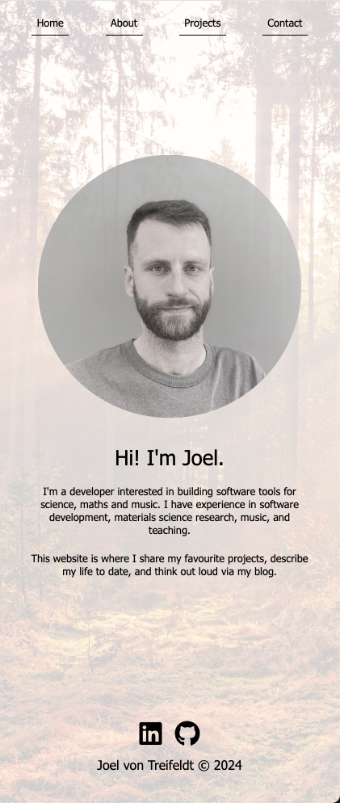

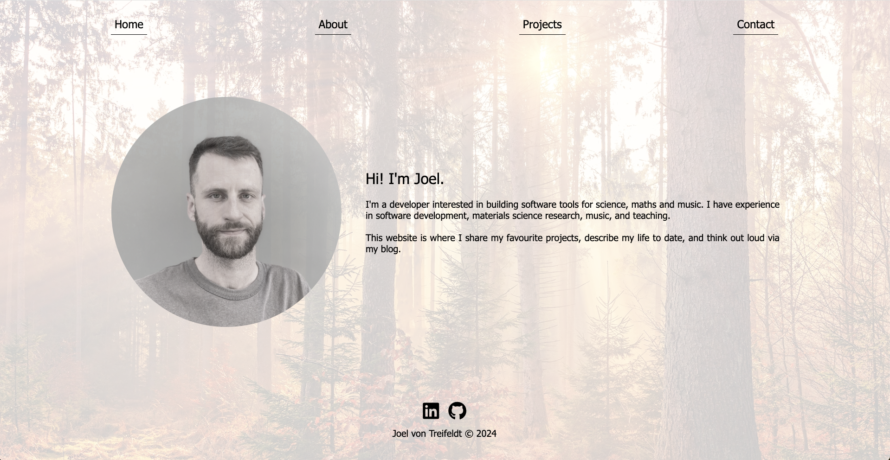

#### About

The About page describes my life and my interests.

##### Introduction

The introduction contains a heading and an elaboration of my activites, history, goals and interests.

##### Experience

Academic and employment history is outlined in this section.

##### Resume portal

The About page contains the link to my resume, which opens in a new tab.

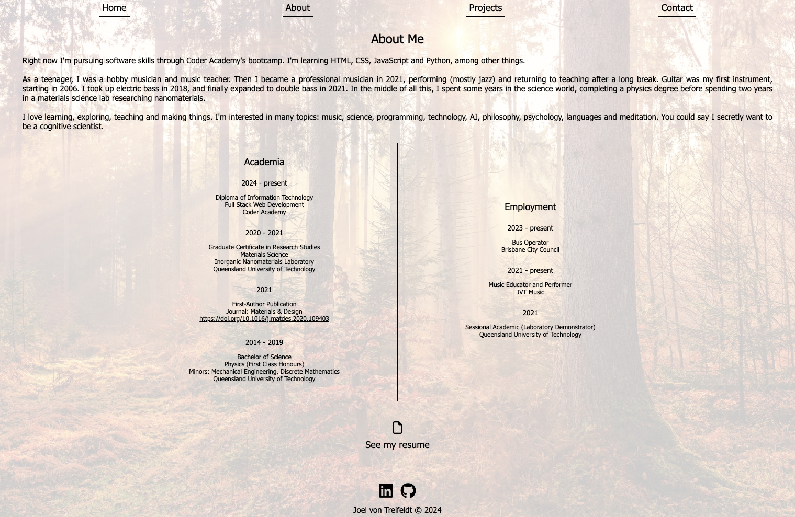

#### Projects

The Projects page brings together software, education, maths, science and music to showcase the tools that I have built. It also links to my blog.

##### Introduction

The introduction contains a heading and a brief description of the tools I've built.

##### Tools

The contains tool names and images, organised into maths, science, and music categories.

The tools are slightly transparent, but hovering over them bring them into full opacity and color to engage the audience.

##### Blog portal

The Project page is where my blog can be accessed.

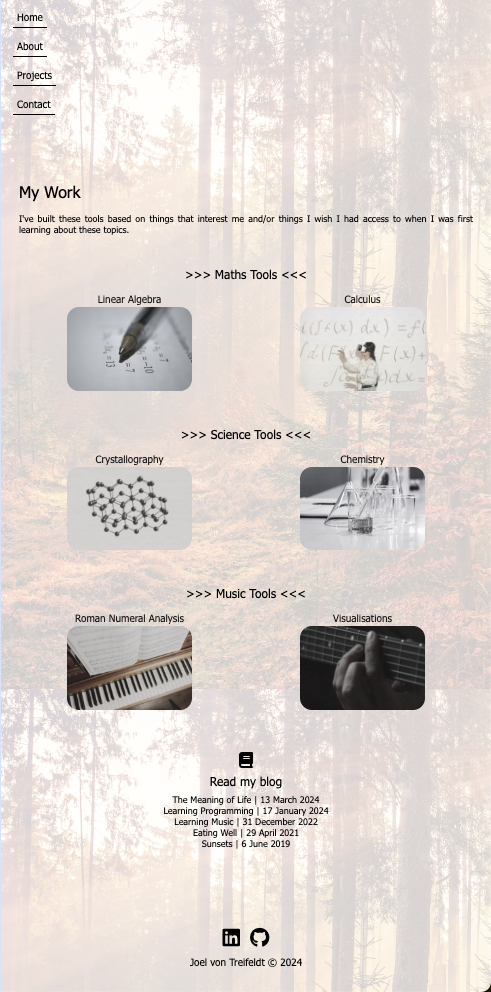
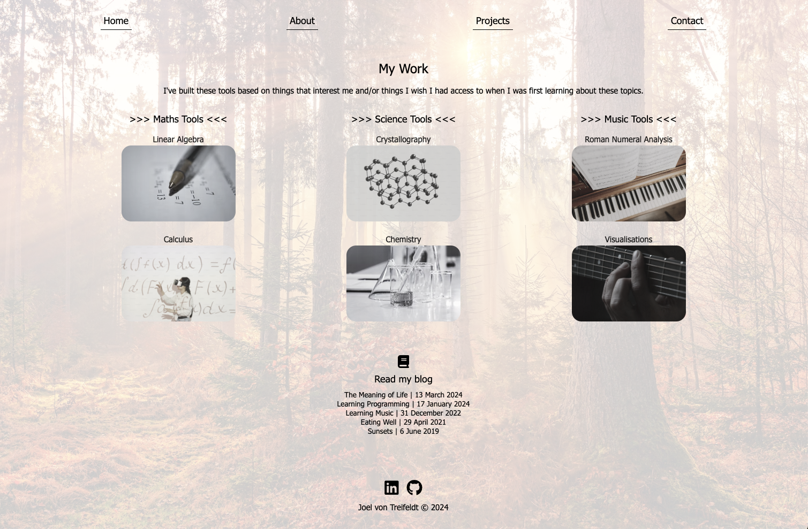

#### Contact

The Contact page is where all contact details and functionality can be found.

##### Contact form

The Contact form includes a heading and a form to fill out if someone would like to contact me. The input fields become transparent when hovered over, and focusing on them creates a blue border and a gray background which helps with accessibility. The submit button doesn't yet work, but hovering turns it transparent.

##### Direct contact

The "direct contact" element provides my details if someone would like to skip the contact form.

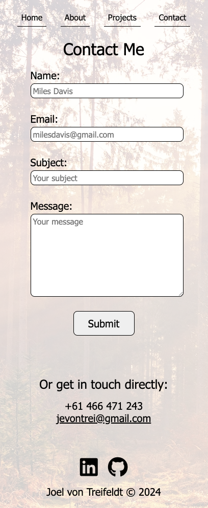
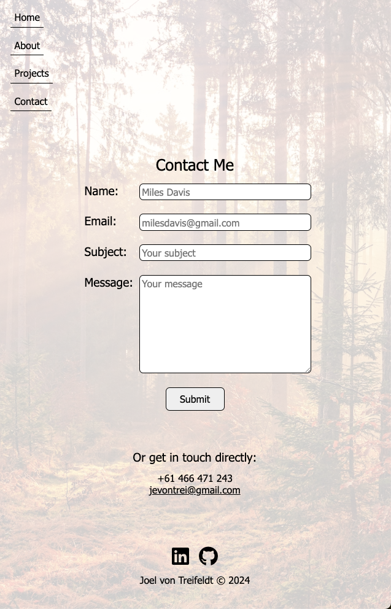
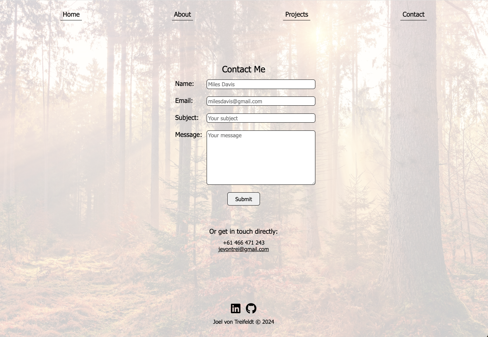

#### Blog/s

The Blog consists of five pages, one for each blog post.

##### Blog contents

Each Blog page contains a heading with links to all other blog posts, with titles and dates published.

##### Secret fun fact

Each Blog page has a hidden fun fact which is revealed when hovered over.

##### Blog images

Each post has a unique image associated with the text.

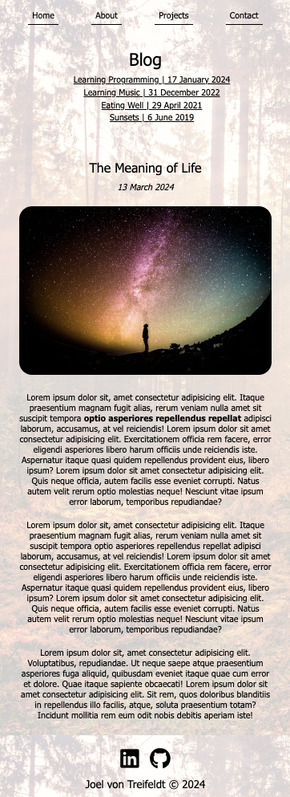
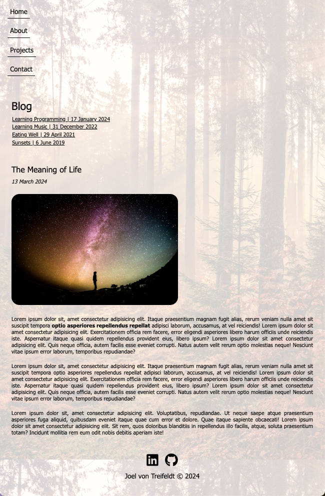

---

## Sitemap

The structure of the website is such that all the primary pages (Home, About, Projects, Contact) be be accessed from any other page via the navigation menu. Every page has external links to social media pages in the footer.

The Home page has no unique links.

The About page has an external link to my journal article and a link to my resume, which opens in a new tab. Both links lose their underline when hovered over.

The Projects page has links for each tool, but they don't go anywhere yet. Hovering over a tool brings the images into full color and opacity, and underlines the tool name. There is also a blog portal on this page, with links to each blog post. Hovering here also underlines each link.

The Contact page has a submit button and a "mailto:" link for my email address, neither of which fully function yet.

The Blog pages are only accessible from the Projects page and each individual Blog page. This keeps the navigation menu as simple as possible, and the blog naturally fits within the category of "my work". Each Blog page has links to every other blog post, which become underlined when hovered over.

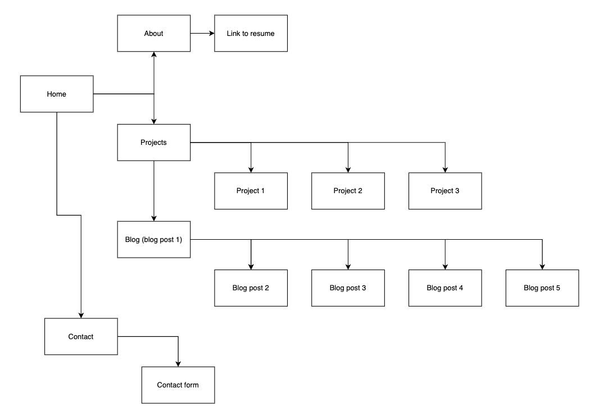

---

## Wireframes

Mockup designs for each page and for each screen size are provided below. The website was designed to have a clean, spacious, approachable and minimalist aesthetic.

### Wireframe screenshots

#### Home wireframes

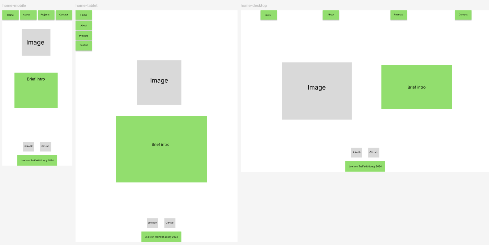

#### About wireframes

#### Projects wireframes

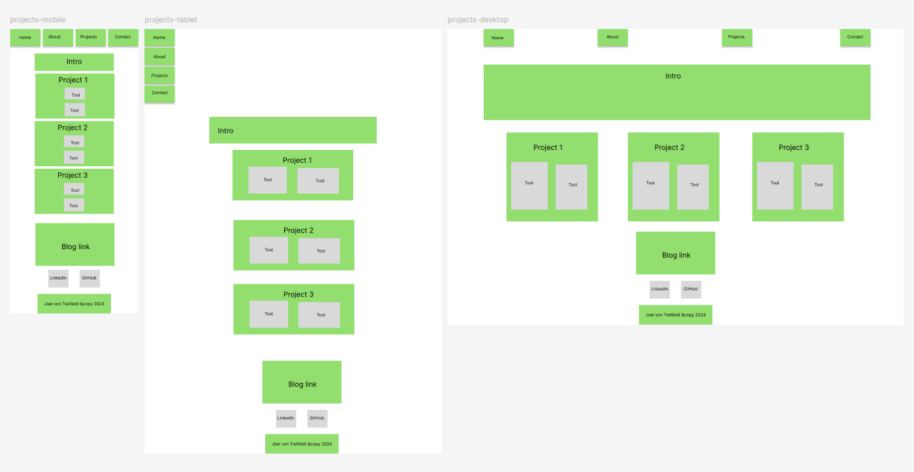

#### Contact wireframes

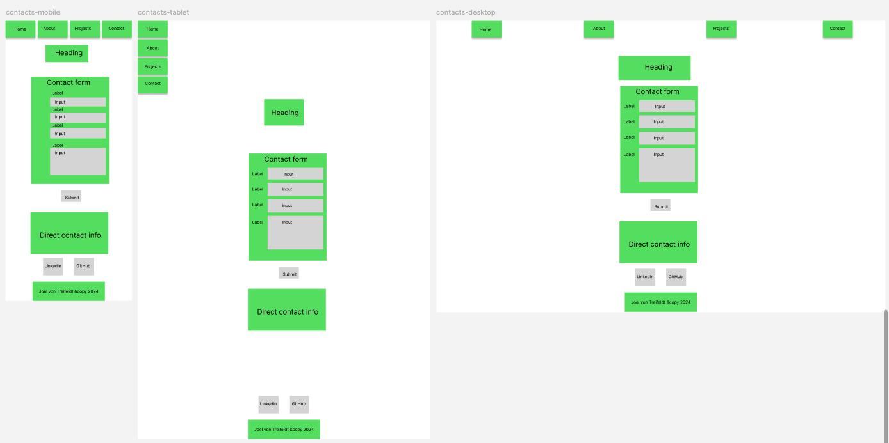

#### Blog wireframes

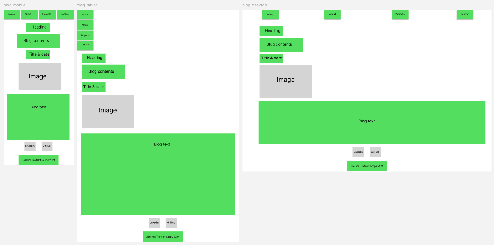

---

## Target audience

This site is aimed at employers, colleagues, peers, and anyone interested in using the tools I've built.

---

## Tech stack

- HTML for content
- CSS for styling
- Flexbox for styling
- GitHub for version history and deployment
- Netlify for deployment
- Figma for wireframes
- draw.io for sitemap
